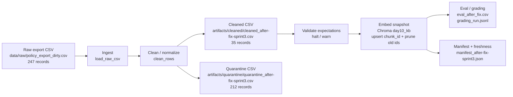

# Kiến trúc pipeline — Lab Day 10

**Nhóm:** ___________  
**Cập nhật:** 2026-06-10  
**Run tham chiếu:** `after-fix-sprint3`

---

## 1. Sơ đồ luồng



Pipeline chạy theo entrypoint:

```bash
python etl_pipeline.py run
```

Mỗi run ghi `run_id`, `raw_records`, `cleaned_records`, `quarantine_records`, đường dẫn cleaned/quarantine, manifest và freshness status vào `artifacts/logs/run_<run_id>.log`.

---

## 2. Ranh giới trách nhiệm

| Thành phần | Input | Output | Owner nhóm |
|------------|-------|--------|------------|
| Ingest | `data/raw/policy_export_dirty.csv` | list raw rows, `raw_records=247` | Ingestion Owner |
| Transform | raw rows | cleaned rows + quarantine rows | Cleaning / Quality Owner |
| Quality | cleaned rows | expectation result, halt/warn decision | Cleaning / Quality Owner |
| Embed | cleaned CSV | Chroma collection `day10_kb` | Embed Owner |
| Monitor | manifest + log + eval | freshness status, grading evidence | Monitoring / Docs Owner |

---

## 3. Cleaning và validation chính

Pipeline chỉ publish các source cần cho grading:

- `policy_refund_v4`
- `sla_p1_2026`
- `it_helpdesk_faq`
- `hr_leave_policy`
- `access_control_sop`

Các rule chính:

- Quarantine `doc_id` ngoài allowlist.
- Parse `effective_date` về ISO `YYYY-MM-DD`.
- Quarantine HR 2025 theo ngày cũ và theo marker nội dung `10 ngày phép năm` + `bản HR 2025`.
- Fix stale refund window từ `14 ngày làm việc` về `7 ngày làm việc`.
- Normalize marker nhiễu `Nội dung không rõ ràng:` và `!!!`.
- Quarantine dòng rỗng sau normalize.
- Enrich SLA P1 escalation/update để top-k retrieval nhỏ vẫn có đủ context.

Expectations quan trọng:

- `refund_no_stale_14d_window` — halt.
- `hr_leave_no_stale_10d_annual` — halt.
- `effective_date_iso_yyyy_mm_dd` — halt.
- `cleaned_doc_ids_in_allowlist` — halt.
- `required_grading_sources_present` — halt.
- `no_export_noise_markers` — warn.

---

## 4. Idempotency & rerun

Embed dùng `chunk_id` ổn định từ `doc_id`, nội dung chunk và sequence. Khi chạy lại, pipeline dùng `col.upsert(ids=ids, ...)` để ghi đè chunk cùng id. Trước khi upsert, pipeline đọc ids hiện có trong Chroma và xóa các id không còn trong cleaned run hiện tại.

Evidence từ log:

```text
embed_prune_removed=1
embed_upsert count=35 collection=day10_kb
```

Nhờ vậy rerun không làm phình vector store và không để chunk stale, ví dụ refund `14 ngày`, còn tồn tại trong top-k.

---

## 5. Monitoring và freshness boundary

Freshness hiện đo ở boundary publish/manifest bằng `latest_exported_at` trong cleaned rows. Run `after-fix-sprint3` có:

```text
latest_exported_at=2026-04-10T00:00:00
freshness_check=FAIL
reason=freshness_sla_exceeded
sla_hours=24
```

Kết luận: quality và grading pass, nhưng snapshot dữ liệu mẫu đã cũ so với ngày chạy 2026-06-10. Đây là cảnh báo vận hành cần ghi trong runbook.

---

## 6. Liên hệ Day 09

Day 09 dùng agent/RAG để trả lời dựa trên knowledge base. Pipeline Day 10 làm mới tầng dữ liệu trước khi agent đọc: raw export được clean, validate rồi embed vào Chroma collection `day10_kb`. Trong demo lab, collection này tách với Day 09 để grading ổn định, nhưng cùng case CS + IT Helpdesk và có thể dùng lại làm corpus cho worker retrieval của Day 09.

---

## 7. Rủi ro đã biết

- `freshness_check=FAIL` do data mẫu có `exported_at` cũ; cần phân biệt lỗi freshness với lỗi cleaning.
- Một số rule đang hard-code cho lab, ví dụ HR cutoff và required sources; bản production nên đọc từ `contracts/data_contract.yaml`.
- Self-eval câu `q_p1_update_frequency` có expected keyword đúng nhưng top-1 chưa phải `sla_p1_2026`; grading chính thức 10 câu vẫn pass.
